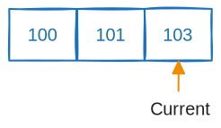
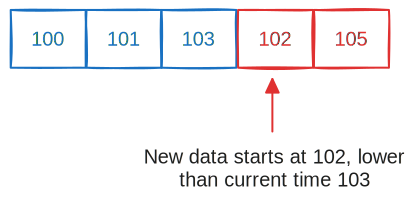
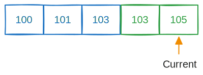

# TS_ADD_EVT
Add event(s) to a time series.


|Param|Type|Description|
|:---|:---:|:---|
|ts|string|Name for the series|
|t|array  of times|An array of timestamps (64-bit signed integers), in ascending order|
|evt|array of objects|Each object represents an event|

<br/>

`TS_ADD_EVT` appends to the series, so the times (`t`) must be in order over the lifetime of the series.

Each `TS_ADD_EVT` must not submit a time that is lower than the current time in the series (i.e. it can be equal to or greater than the current time).

:::warning
To reduce compute, the server does not check the time ordering.

A future release could check the ordering as an option of the time series, returning an error if incorrect.
:::

<br/>

Sending this:

```json
{
  "TS_ADD_EVT":
  {
    "ts":"temps",
    "t":[100, 101, 103],
    "evt":
    [
      {"temp":3},
      {"temp":4},
      {"temp":5}
    ]
  }
}
```

The series times are:



Followed by:

```json
{
  "TS_ADD_EVT":
  {
    "ts":"temps",
    "t":[102, 105],
    "evt":
    [
      {"temp":6},
      {"temp":7}
    ]
  }
}
```

Is invalid because the second command starts at time `102`, but the time series is at time `103`.




But you could send:

```json
{
  "TS_ADD_EVT":
  {
    "ts":"temps",
    "t":[103, 105],
    "evt":
    [
      {"temp":6},
      {"temp":7}
    ]
  }
}
```

Because it starts at time `103` which is **not less** than series current time (`103`). After this command the current time becomes `105`:




## Examples

- Add three events at times 100, 102 and 105:

```json
{
  "TS_ADD_EVT":
  {
    "ts":"user_login",
    "t":[100, 102, 105],
    "evt":
    [
      {"userId":"1000", "action":"login"},
      {"userId":"1001", "action":"login"},
      {"userId":"1002", "action":"logout"}
    ]
  }
}
```

- You can have multiple occurences of the same time:

```json
{
  "TS_ADD_EVT":
  {
    "ts":"user_login",
    "t":[110, 110, 112],
    "evt":
    [
      {"userId":"1000", "action":"logout"},
      {"userId":"1001", "action":"logout"},
      {"userId":"1003", "action":"login"}
    ]
  }
}
```


- Events can contain more than strings

```json
{
  "TS_ADD_EVT":
  {
    "ts":"log",
    "t":[500, 505],
    "evt":
    [
      {"program":"nemesisdb", "args":["--config=/etc/nemesisdb/config.json"], "user":"ndb", "root":false},
      {"program":"redis-server", "args":["/etc/redis/config.conf"], "user":"redis", "root":false}
    ]
  }
}
```


## Response

`TS_ADD_EVT_RSP`

See the [response status](./../TS-Statuses) page for status values.


|Param|Type|Meaning|
|:---|:---|:---|
|st|unsigned int|Status|

<br/>

Possible status values:

- Ok
- SeriesNotExist
- ParamValue
  - `t` and `evt` are not the same size
  - `t` or `evt` is empty
- ParamType
  - `evt` is not an array of objects
  - `t` is not an array of signed integers

