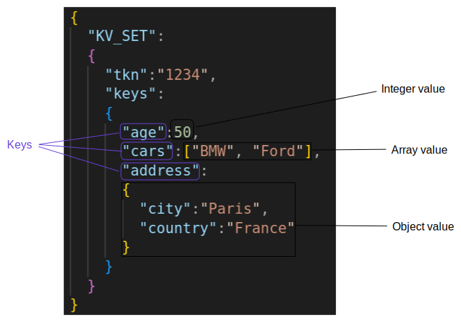

# Key Values
NemesisDB uses the key-value nature of JSON to manage data.

If we have this JSON:

```json
{
  "age":50,
  "cars":["BMW", "Ford"],
  "address":
  {
    "city":"Paris",
    "country":"France"
  }
}
```

`age`, `cars` and `address` are keys:

- `age` has a number value
- `cars` has an array value 
- `address` has an object value


This is how NemesisDB treats the data when stored:

- `age` is mapped to `50`
- `cars` is mapped to `["BMW", "Ford"]`
- `address` is mapped to `{"city":"Paris","country":"France"}`




<br/>

## Set

To store the above, you can use the `KV_SET` command:

```json
{
  "KV_SET":
  {
    "tkn":1234,
    "keys":
    {
      "age":50,
      "cars":["BMW", "Ford"],
      "address":
      {
        "city":"Paris",
        "country":"France"
      }
    }
  }
}
```

- `tkn` is the session token, explained in the session [tutorial](../tutorials/sessions/what-is-a-session#session-token)
- `keys` are the key and values to store

<br/>

## Get
To get the above keys:

```json
{
  "KV_GET":
  {
    "tkn":1234,
    "keys":["age", "cars", "address"]
  }
}
```

- `tkn` identifies which session data want to access
- `keys` arrays of keys to retrieve

This returns:

```json
{
  "KV_GET_RSP":
  {
    "tkn":1234,
    "keys":
    {
      "age":50,
      "cars":["BMW", "Ford"],
      "address":
      {
        "city":"Paris",
        "country":"France"
      }
    }
  }
}
```

<br/>
<hr/>

The session [tutorial](../tutorials/sessions/what-is-a-session#session-token) explains sessions or you could skip to [first steps](../tutorials/first-steps/setup) to start using NemesisDB.
