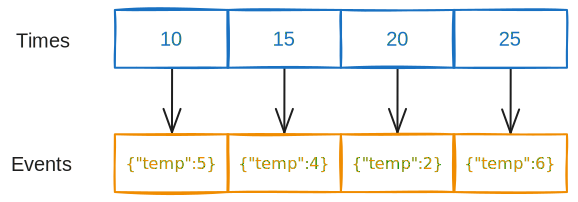

# TLDR - Time Series

NemesisDB is a JSON in-memory database:

- Time series data is stored in memory
- Writing time series data to disk is not supported yet


## Structure
The time series implementation is intentionally simple:

- An event occured at a particular time
- A time series is created, identified by a unique name
- Time is a signed 64-bit integer
- An event is a JSON object
- Top level event members can be indexed


Internally, time and event data are stored in parallel vectors (resizeable arrays). This is straight forward to find an event from its time (and vice versa) and also benefits from cache/spatial locality because vectors are contiguous in memory.

The API works in a similar manner. To add events you supply an array of times (`t`) and an array of events (`evt`). 

To record four temperature readings at times 10, 15, 20 and 25:

```json
{
  "TS_ADD_EVT":
  {
    "ts":"series1",
    "t":[10,15,20,25],
    "evt":
    [
      {"temp":5},
      {"temp":4},
      {"temp":2},
      {"temp":6}
    ]
  }
}
```

- `ts` is the time series name
- `t` is the time array (which must be in ascending order)
- `evt` is the events array

An event at `evt[i]` occured at `t[i]`.

At time 15 the temperature was 4 (`15` is at `t[1]` and `v[1]` is `{"temp":4}`).



<br/>

## Indexes
Top level event members can be indexed, allowing to use them in the `where` clause of `TS_GET` and `TS_GET_MULTI`:

```json
{
  "TS_GET":
  {
    "ts":"series1",
    "rng":[15,25],
    "where":
    {
      "temperature":
      {
        "<":6
      }
    }
  }
}
```

<br/>

- `rng` is "range" which accepts the min and max times (inclusive)
- `where` contains the conditions

The above command says, "Get events which occured between times 15 and 25 inclusive _and_ where the temperature is less than 6". In the above data, this will return times and events for times 15 and 20.

We could also get events for temperatures in a range:

```json
{
  "TS_GET":
  {
    "ts":"series1",
    "rng":[],
    "where":
    {
      "temperature":
      {
        "[]":[4,5]
      }
    }
  }
}
```

- `rng` : no time limits set, whole time series is checked
- `where` : the range operator `[]` is used to find temperatures between 3 and 5 inclusive

This returns events at times 10 and 15.