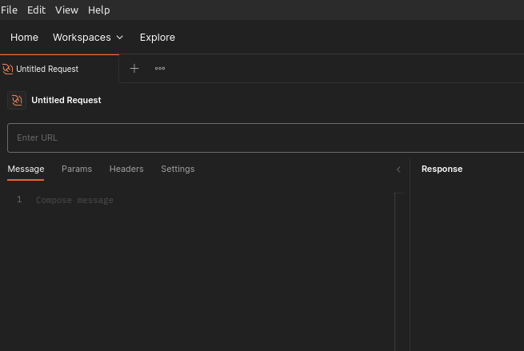
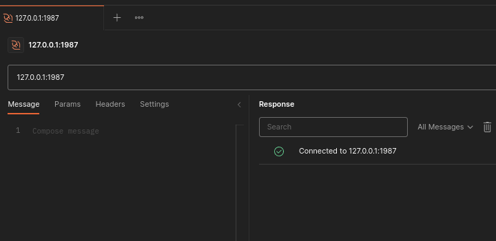

# Setup

:::info
This tutorial is for when the server is in "kv" mode (key value with sessions are disabled).

The commands are the same except:

- Loading and saving data use different commands
- When sessions are enabled the session token must be set in all `KV_` commands
:::


## Install Postman
The tutorial uses the Postman tool as a WebSocket client. The free version is suitable and can be [downloaded](https://www.postman.com/downloads/) for Windows, Linux and Mac.

## Configure and Start NemesisDB

Start the server with the default config:

1. Change to the install directory, default is `/usr/local/bin/nemesisdb`
2. In `default.jsonc` ensure `sessionsEnabled` is `false`.
3. In a terminal:

```bash title="Start server"
./nemesisdb --config=default.jsonc
```

This starts the server on `127.0.0.1:1987`.


## Check Connection

1. Open Postman
2. `File->New` or `ctrl+n` and select WebSocket




3. In "Enter URL" box, set `127.0.0.1:1987` and press Enter (or press Connect)




:::info
The default view will have the "Response" pane below the request. If you prefer the two pane view as the screenshot, you do so by:

1. `File->Settings`
2. In the "General" tab, towards the right, select "Two-pane view"
:::
