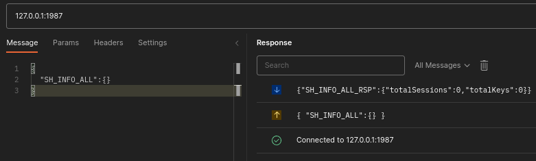

# Create Session

This shows how to create a session, store data and then get that data.


## All Session Info

Start by confirming there are no sessions - there can't because we're starting from an empty database, but the command may be useful later.


Paste this into the "Compose message" box and press Send:

```json
{
  "SH_INFO_ALL":{}
}
```

The 'Response' pane shows our request and the response:




The response confirms we have no sessions or keys.


## Create Session

`SH_NEW` is used to create a session. Paste and send this:

```json title="Session without expiry"
{
  "SH_NEW":
  {
    "name":"user1"
  }
}
```

The response will be similar to the following:

```json
{
  "SH_NEW_RSP": {
    "st": 1,
    "name": "user1",
    "tkn": "14247375118774737462"
  }
}
```

- `st` is the status. 1 means Ok/Success
- `name` is the same name as in the request
- `tkn` is the session token (you'll have a different value)


:::tip
Keep the token safe, you'll need this in subsequent steps.
:::


## Session Info
To get information for a particular session we use `SH_INFO`.

Send the following, **replacing** `tkn` with your token:

```json
{
  "SH_INFO": {
    "tkn": "14247375118774737462"
  }
}
```

The response will be:

```json
{
  "SH_INFO_RSP": {
    "st": 1,
    "tkn": "14247375118774737462",
    "shared": false,
    "keyCnt": 0,
    "expiry": {
      "expires": false,
      "duration": 0,
      "time": 0,
      "deleteSession": false
    }
  }
}
```

- `st` is the status
- `tkn` the token
- `shared` is false because this is not a shared session
- `keyCnt` is the key count
- `expiry` contains expiry information. `expires` is false so other params can be ignored


:::info Status not Ok
If your `st` is `100`, it's because you forgot to change the `tkn`.

It should be the same value as received in `SH_NEW_RSP` above.
:::


We're ready to store data now.


:::tip Postman
Tabs
- You can open new connections in their own tab
- Press the "+" symbol beside a tab to create a new tab (or `File->New Tab` or `ctrl+t`)

Enable Dark Theme
- `File->Settings`
- "Theme" tab
:::