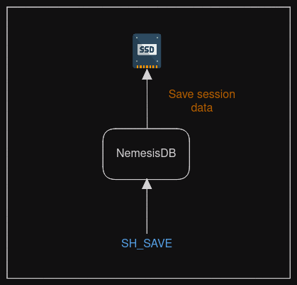

# Overview

NemesisDB is an in-memory/caching database meaning data is only stored in server RAM unless commanded to write data to the filesystem. When the server shutsdown all data in RAM is lost so persisting the data to filesystem allows you to restore data.

For some applications this may not be required because you can rebuild the data via the query interface, but there may be cases where minimal data is useful is required on startup such as default app settings, IP addresses or config values.

- All sessions or a specific settings can be saved
- Data can be restored at startup with a command line argument or during runtime with a command.

<br/>

## Persistance Structure
Data is saved with a name and a timestamp. The name is used when loading as a way to identify which data to restore.

The server's config file has a setting for the save path, in to which the data is written.

The structure is:

```bash
└── <name>
    └── <timestamp>
        ├── data
        └── md
```

|Directory|Purpose|
|:---|:---|
|name|The name used in the save command|
|timestamp|Timestamp when the data was saved|
|data|Contains the session data|
|md|Contains metadata|

<br/>

This structure allows you to save and restore specific data.


For example, if we save data using the name `defaults` we will have:

```bash
.
└── defaults
    └── 1701060607618993128
        ├── data
        └── md
```

If we send another save command with the same name:

```bash
└── defaults
    ├── 1701060607618993128
    │   ├── data
    │   └── md
    └── 1701061180908039731
        ├── data
        └── md
```

:::info
The current version does not allow you to load a specific timestamp, it always selects the most recent. <br/>

If you need to restore specific data, use a different name for each of the save command.
:::

<br/>

## Saving



The `SH_SAVE` command is used to store the data:

```json
{
  "SH_SAVE":
  {
    "name":"defaults"
  }
}
```

Or to save specific sessions supply their tokens:

```json title="Save two sessions"
{
  "SH_SAVE":
  {
    "name":"defaults",
    "tkns":[123456, 654321]
  }
}
```

<br/>

## Loading
There are two ways to restore data:

- At startup using `--loadName`:
- At runtime with `SH_LOAD`:


The effects are the same, but:

- `--loadName` can be used with `--loadPath` to read data from a path that's different from that in the server config
- `SH_LOAD` offers the flexibility to load data at any time
- `SH_LOAD` will only read data from the path in the server config


<br/>

## Usage
The intention is to offer flexibility:

- Save all or specific sessions
- Load data on startup to work from a known base, perhaps as part of the deployment process
- Load data ad-hoc

The server can be populated with particular data, cleared and then loaded with data for a different purpose without restarting.

<br/>

## Performance
The governing factor for saving and restoring is the storage throughput rather than the server.

Example:

- **Database:** 1M sessions, each with five keys (so 5M keys total)
- **Disk Space:** ~380MB
- **Storage:** Laptop NVME
- **Save:** 3.1 seconds 
- **Load:** 6.5 seconds

The save process minimises memory use:

1. Data is prepared in a buffer
2. When buffer reaches a defined limit, flush to a data file
3. Reset buffer positions
4. Continue from 1

Each data file is max size (currently 10MB). This is to control memory use during loading.
