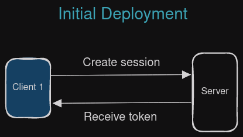
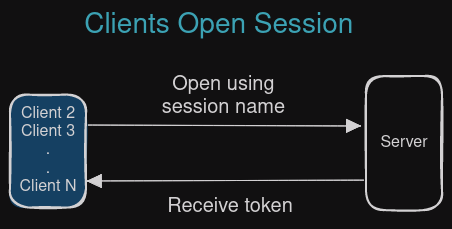

# Shared Session
Shared sessions let different services access the same session without knowing the token. This is useful if there are multiple independent backend services that require access to the same session, whilst avoiding having to distribute the session token to each service. 

A normal (non-shared) session token is randomly generated, so if two clients create a session with the same name, they will receive a different token.

But with a shared session, the name is used to generate the token which lets `SH_OPEN` generate the same token if the name is the same **and** the session is shared.

If `SH_OPEN` attempts to open a session that isn't shared, it will fail.

## Shared Session Use Case
We have a platform that has web and mobile app users. We need default settings for both types in a session that never expires. The backend services that handle web and mobile users are completely separate, perhaps different micro services. We need a practical way to access default data without bothering the primary database, hardcoding values or using config files.

1. On initial deployment we use `SH_NEW` to create a shared session that never expires

 

2. Services that require access use `SH_OPEN` with the session name

3. Clients have the shared session's token which they use in subsequent commands

 
 

## Shared Session Token Generation
When a shared session is created with `SH_NEW` the token is generated from the session name. This ensures when `SH_OPEN` is used with the same name, the same token is returned.

:::important
A session opened with `SH_OPEN` is not restricted - i.e. data be deleted or update by any client with the token.

This is because NemesisDB doesn't authenticate users yet, which is required to determine if a client has permission to perform an action.
:::
