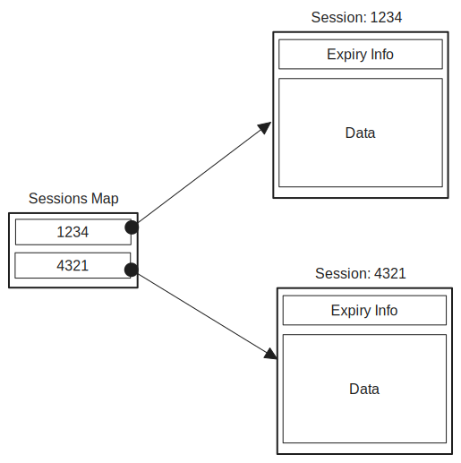

# What is a Session
A session is just a container with a dedicated map for storing key-values.

They are called sessions because data is intended to be stored for a period of time before being deleted:

- A session can live forever
- A session can expire
  - When a session expires, all its data is deleted
  - The session and data can be deleted or just the data. If you only delete data, you can continue to use the session
- You can create as many as sessions as required (within memory limits)

## Examples

### Music Streaming App

1. When a user logs on, check the for this user's session
2. If no session exists
    1. Retrieve playlist data from primary database
    2. Create session with an expiry
    3. Populate session with playlist data
3. Whilst the users accessing the playlist (playing tracks, adding tracks etc) the session expiry is extended
4. When the user stops interacting with the data (they close the app), the session will eventually expire, deleting the data 

 

### One Time Password

1. Create a session with an expiry, storing the OTP
2. If the user does not confirm the OTP within the time, their session will delete and fail OTP validation

 

## Session Token
A session is identified by a token, which is a 64-bit integer. When you create a session the server returns a token which is used with commands to access the data.

 

## Session Data
Each session has a dedicated data store. When you store, get, update etc session data, you are only accessing that particular session's data store.

- When you are finished with the data you can end the session
- If the session was created with an expiry duration, the session and data can both be deleted, or just the data

A visual representation of two session with tokens `1234` and `4321`. Each token is mapped to dedicated expiry info and data:

 

## Shared Sessions
A session doesn't belong to a particular client via some authentication process - it can be accessed by any client with the token. But there may be cases where sharing a session is useful, for example a session
that stores default settings which are common to many areas of the backend services. 

You could distribute the session token amongst all clients, but this adds complexity. This is what shared sessions are for.

When a session is shared, the session token can be retrieved from just the session name.

  
Token Generation

  

    

      If a session is not shared: 
      <ul>
        <li>The session name does not take part in token generation. This means two sessions with the same name do not generate the same token</li>
      </ul>
      If a session is shared: 
      <ul>
        <li>The session name is used in token generation, allowing others to get the token from session name</li>
      </ul>
        
    
   
  

 

 

# Example - Pizza Delivery
A pizza delivery app must track pizzas as they are out for delivery, but once delivered, the delivery data can be discarded.

1. When a pizza is out the oven and assigned to a driver, start a new session
2. Update the session data as the driver delivers (position, estimated time, etc)
3. When a pizza is delivered, the session is ended, deleting the data

An alternative is to have a session per driver. When a pizza is delivered its key is deleted from the session. The session ends when the driver finishes their shift.

 

# Example - Shopping Basket
An ecommerce website lets customers add items to their basket, but many customers are just 'window shopping' - they add items to their basket without any intention to actually buy the products.

1. Create a session when a customer visits the site (or adds their first item)
2. Store each basket item in the session
3. Set the session expiry duration to a reasonable time to allow delays and decisions
4. If the customer leaves the site without completing the order, the basket will be cleared when the sessions expires

